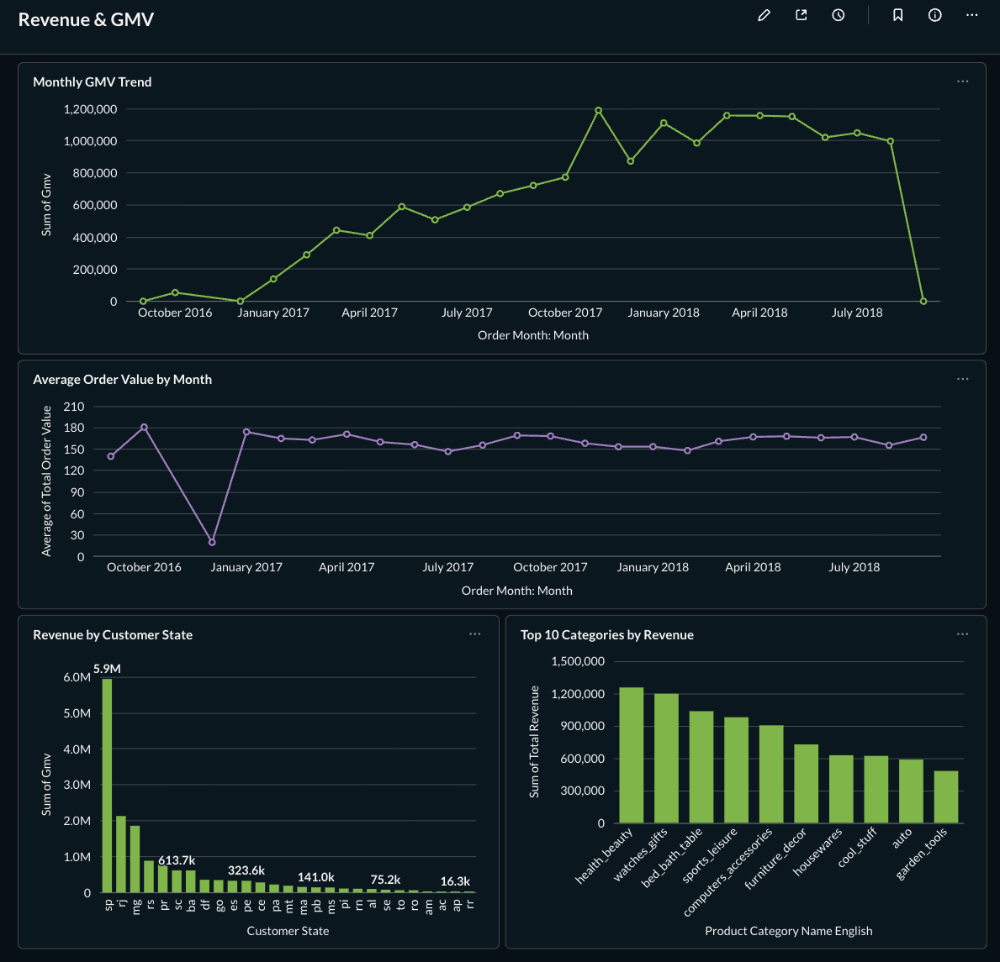
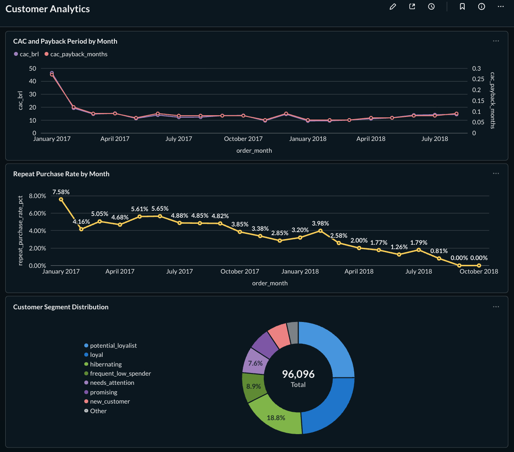
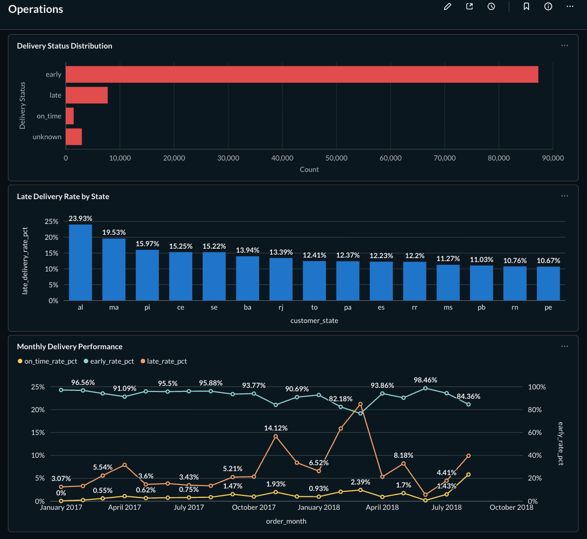
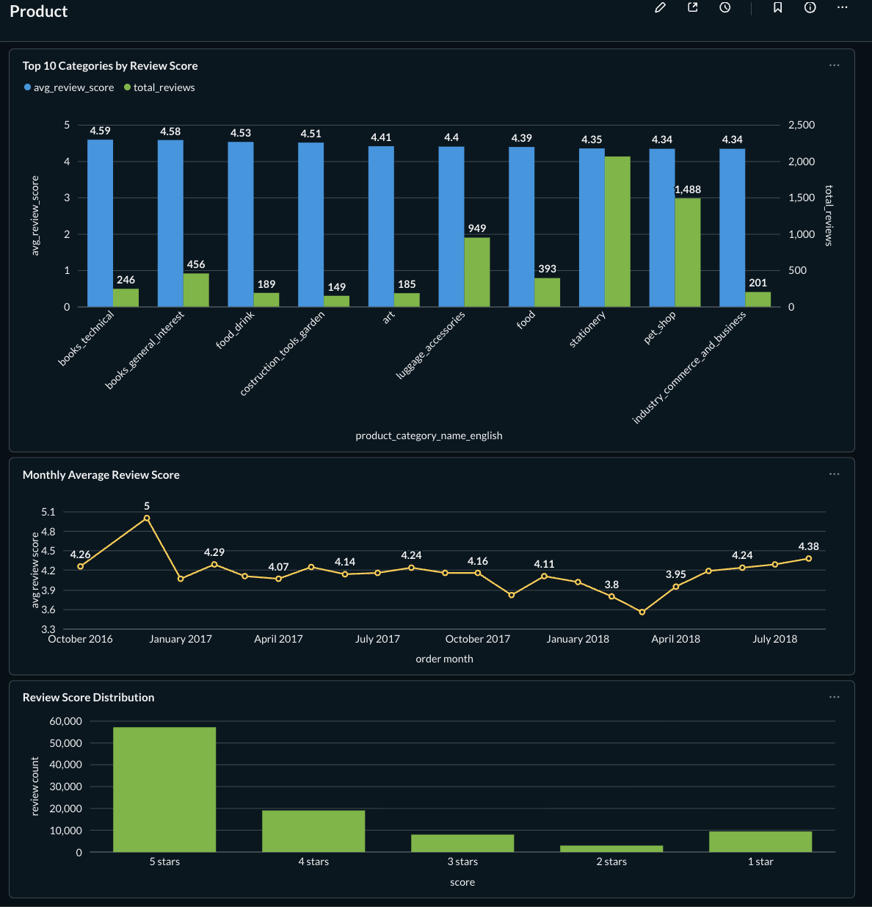

# dbt-olist-metrics

A production-style e-commerce metrics layer built with dbt and BigQuery on the [Olist Brazil dataset](https://www.kaggle.com/datasets/olistbr/brazilian-ecommerce) from Kaggle. The project demonstrates a full analytics engineering workflow: raw data ingestion, layered dbt transformations, a MetricFlow semantic layer, automated CI/CD, and a self-hosted Metabase dashboard.

---

## Table of Contents

- [Architecture](#architecture)
- [Project Structure](#project-structure)
- [Data Model](#data-model)
- [Metrics Defined](#metrics-defined)
- [Dashboards](#dashboards)
- [Tech Stack](#tech-stack)
- [Getting Started](#getting-started)
- [CI/CD](#cicd)
- [Known Data Quality Issues](#known-data-quality-issues)

---

## Architecture

1. **Raw CSVs** (Kaggle) → downloaded manually into `data/`
2. **Python ingestion** (`scripts/load_to_bq.py`) → loads to `olist_raw` in BigQuery
3. **dbt Staging** → views with renaming, casting, timezone conversion
4. **dbt Intermediate** → joins, aggregations, derived fields
5. **dbt Marts** → domain fact and dimension tables materialized as tables
6. **MetricFlow** → semantic layer with metric definitions
7. **Metabase** → self-hosted dashboards via Docker on `olist_prod`

---

## Project Structure
```
dbt-olist-metrics/
├── .github/workflows/ci.yml
├── docs/screenshots/
├── olist_metrics/
│   ├── models/
│   │   ├── staging/
│   │   ├── intermediate/
│   │   ├── marts/
│   │   │   ├── core/
│   │   │   ├── finance/
│   │   │   ├── marketing/
│   │   │   ├── operations/
│   │   │   ├── product/
│   │   │   └── ml/
│   │   └── metrics/
│   ├── tests/
│   ├── seeds/
│   └── dbt_project.yml
├── scripts/load_to_bq.py
├── docker-compose.yml
└── pyproject.toml
```

---

## Data Model

### Source Tables (`olist_raw`)

| Table | Description |
|---|---|
| `orders` | One row per order, central fact |
| `order_items` | One row per item within an order |
| `order_payments` | Payment transactions per order |
| `order_reviews` | Customer reviews per order |
| `customers` | Customer dimension |
| `products` | Product dimension |
| `sellers` | Seller dimension |
| `geolocation` | ZIP code to lat/lng mapping |
| `product_category_name_translation` | Portuguese to English category mapping |

### Staging Layer (`olist_dev` / `olist_prod`)

All staging models are materialized as **views**. Transformations applied:
- Column renaming and type casting
- Financial columns cast to `NUMERIC` rounded to 2 decimals
- Timestamps converted to `DATETIME` in `America/Sao_Paulo` timezone
- String columns lowercased for consistency
- `freight_value` renamed to `shipping_value`
- Typos fixed (`product_name_lenght` → `product_name_length`)

### Intermediate Layer

| Model | Description | Grain |
|---|---|---|
| `int_orders_with_payments` | Orders + aggregated payment info | order |
| `int_orders_with_items` | Orders + item/freight aggregates | order |
| `int_orders_with_reviews` | Orders + review scores | order |
| `int_orders_enriched` | Central enriched order table joining all above | order |
| `int_customers_with_orders` | Customer order history aggregates | customer |
| `int_products_with_category` | Products + English category translation | product |

### Marts Layer

#### Core
| Model | Description | Grain |
|---|---|---|
| `fct_orders` | Central order fact table | order |
| `dim_customers` | Customer dimension with RFM segmentation | customer |
| `dim_products` | Product dimension with physical attributes | product |

#### Finance
| Model | Description | Grain |
|---|---|---|
| `fct_revenue` | Order-level revenue, excludes canceled orders | order |
| `fct_payments` | Payment transaction fact table | payment transaction |

#### Marketing
| Model | Description | Grain |
|---|---|---|
| `fct_customer_orders` | Customer order history with RFM scores | customer |
| `fct_cac_payback` | Monthly CAC and payback period (synthetic spend data) | month |

#### Operations
| Model | Description | Grain |
|---|---|---|
| `fct_deliveries` | Delivery performance per order | order |
| `fct_seller_performance` | Seller metrics by month | seller + month |

#### Product
| Model | Description | Grain |
|---|---|---|
| `fct_category_performance` | Revenue and delivery metrics by category | category + month |
| `fct_order_reviews` | Order-level review metrics | month + state |
| `fct_product_reviews` | Product-level reviews (single-product orders only) | product + month |

#### ML Feature Store
| Model | Description | Grain |
|---|---|---|
| `fct_customer_features` | Customer features for churn/LTV models | customer |
| `fct_order_features` | Order features for delivery delay prediction | order |
| `fct_product_features` | Product features for recommendation models | product |

---

## Incremental Models & Performance

Four high-volume fact tables use incremental materialization with a 90-day lookback window to capture late-arriving data (status updates, reviews, delivery timestamps):

| Model | Partition | Cluster |
|---|---|---|
| `fct_orders` | `order_purchase_timestamp` (day) | `customer_state`, `order_status`, `delivery_status` |
| `fct_revenue` | `order_date` (day) | `customer_state`, `order_status` |
| `fct_deliveries` | `order_purchase_timestamp` (day) | `delivery_status`, `customer_state`, `order_status` |
| `fct_payments` | `order_date` (day) | `customer_state`, `payment_type` |

First run requires `--full-refresh` to apply partition and cluster configuration. Subsequent runs merge only the last 90 days.

## Metrics Defined

Metrics are defined using MetricFlow on top of the marts layer.

| Metric | Definition |
|---|---|
| `gmv` | Sum of `total_payment_value` on non-canceled orders |
| `order_count` | Total number of orders placed |
| `avg_order_value` | Average `total_payment_value` per order |
| `customer_count` | Total unique customers |
| `repeat_customer_count` | Customers with more than one order |
| `repeat_purchase_rate` | `repeat_customer_count / customer_count` |
| `conversion_rate` | Delivered orders / total orders |
| `late_delivery_rate` | Late deliveries / total delivered orders |

---

## Dashboards

Dashboards are built in self-hosted Metabase (Docker) on top of `olist_prod` BigQuery tables.

### Revenue & GMV


### Customer Analytics


### Operations


### Product


---

## Tech Stack

| Tool | Purpose |
|---|---|
| **dbt Core** | Data transformation and testing |
| **BigQuery** | Cloud data warehouse (GCP) |
| **Python** | Data ingestion (`google-cloud-bigquery`, `pandas`) |
| **MetricFlow** | Semantic layer and metric definitions |
| **Metabase** | Self-hosted BI dashboards |
| **Docker** | Metabase containerization |
| **GitHub Actions** | CI/CD pipeline |
| **Poetry** | Python dependency management |

---

## Getting Started

### Prerequisites
- Python 3.11+
- Poetry
- Docker Desktop
- GCP project with BigQuery enabled
- `gcloud` authenticated locally (`gcloud auth application-default login`)

### 1. Clone the repo
```bash
git clone git@github.com:yourusername/dbt-olist-metrics.git
cd dbt-olist-metrics
```

### 2. Install dependencies
```bash
poetry install
```

### 3. Set up environment variables

Create a `.env` file at the root:

GCP_PROJECT_ID=your-gcp-project-id
GCP_DATASET_ID=olist_raw
GCP_LOCATION=europe-west1

### 4. Load raw data to BigQuery

Download the [Olist dataset from Kaggle](https://www.kaggle.com/datasets/olistbr/brazilian-ecommerce) and place the CSV files in the `data/` folder. Then run:
```bash
poetry run python scripts/load_to_bq.py
```

### 5. Configure dbt profile

Add the following to `~/.dbt/profiles.yml`:
```yaml
olist_metrics:
  outputs:
    dev:
      type: bigquery
      method: oauth
      project: your-gcp-project-id
      dataset: olist_dev
      location: europe-west1
      threads: 4
  target: dev
```

### 6. Run dbt
```bash
cd olist_metrics
poetry run dbt deps
poetry run dbt seed
poetry run dbt build
```

### 7. Start Metabase
```bash
docker compose up -d
```

Open `http://localhost:3000` and connect to BigQuery using your service account credentials, pointing to the `olist_prod` dataset.

---

## CI/CD

GitHub Actions runs `dbt build --target prod` on every PR and push to `main`. The pipeline:

1. Sets up Python 3.11 and Poetry
2. Installs project dependencies
3. Configures dbt profiles using GitHub secrets
4. Runs `dbt deps` to install dbt packages
5. Runs `dbt seed` to load seed data
6. Runs `dbt build` to build all models and run all tests against `olist_prod`

Two GitHub secrets are required:
- `GCP_PROJECT_ID`
- `GCP_SERVICE_ACCOUNT_KEY`

---

## Known Data Quality Issues

| Issue | Location | Handling |
|---|---|---|
| `customer_unique_id` maps to multiple `customer_id` values with different zip codes | `olist_raw.customers` | Grouped by `customer_unique_id` in `int_customers_with_orders`, arbitrary zip kept via `max()` |
| ~100 rows with unescaped quotes in review comments | `olist_raw.order_reviews` | Loaded with `allow_quoted_newlines=True` |
| 11947 geolocation coordinates outside Brazil's bounding box | `olist_raw.geolocation` | Singular test with `severity: warn`, geolocation not used in any mart |
| 1 order with no payment record | `olist_raw.order_payments` | `not_null` test on `total_payment_value` set to `severity: warn` |
| 8 delivered orders with missing delivery timestamps | `olist_raw.orders` | ML feature tests set to `severity: warn` |
| Products with no English category translation | `product_category_name_translation` | `not_null` test on `product_category_name_english` set to `severity: warn` |
| Marketing spend data is synthetic | `seeds/marketing_spend.csv` | Documented in model comments and README |